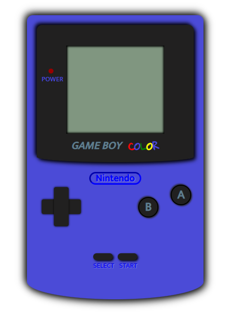

# SIMULACIÓN VIDEOCONSOLA

## Descripción del proyecto
El proyecto, trata de simular una videoconsola portátil utilizando los lenguajes html y css con la propiedad flexbox, para que los elementos utilizados queden ordenados entre si.
Se ha utilizado la plantilla de la videoconsola portátil GameBoy Color de la marca Nintendo.

## Tecnologías
Estos son los lenguajes utilizados:

## Imágenes
Esta es la imágen del proyecto finalizado.

## Funcionalidades
1. Los botones utilizados hacen el efecto de pulsarse al hacer click sobre ellos, aunque verdaderamente no realizan ninguna función.
2. Al pasar el ratón por el display aparece la pantalla de bienvenida de Nintendo GameBoy Color.
3. Al pasar el ratón por el led de power, el led simula el color de encendido.
